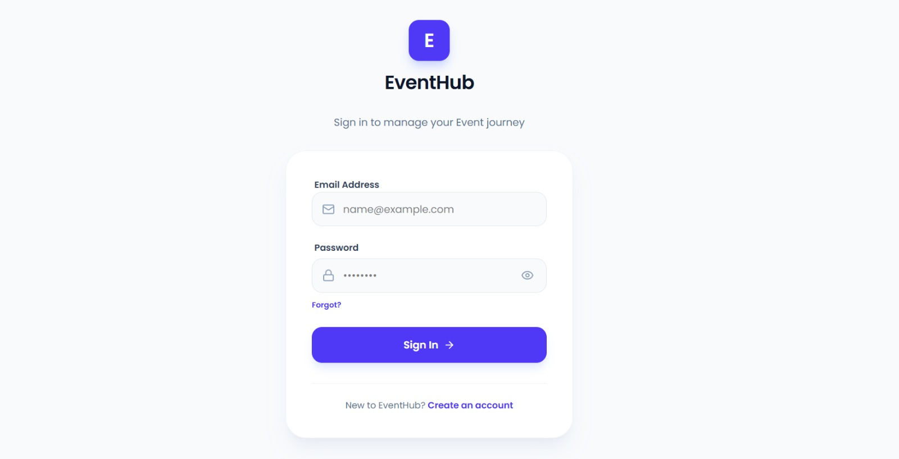
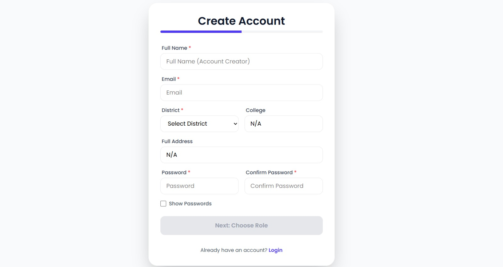
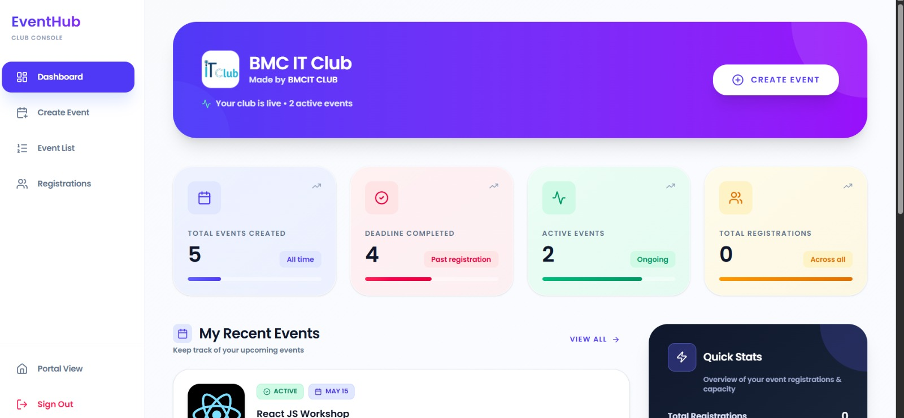

# EventHub

[](https://github.com)
[](LICENSE)
[](https://nodejs.org/)
[](https://www.mongodb.com/)

**EventHub** is a centralized event discovery and management platform for Nepal's IT community. It connects students with verified technical opportunities while helping organizations efficiently manage and promote their events.

## Problem & Solution

**The Challenge**: Students across Nepal miss valuable workshops, hackathons, and tech events due to scattered social media announcements. Meanwhile, organizations struggle to reach their target audience effectively.

**EventHub's Solution**: A unified, intelligent platform that brings all verified IT events to one searchable hub, complete with smart prioritization, location-based discovery, and automated notifications.

## Key Highlights

- **Centralized Verified Hub**: All events in one place with organization verification
- **Smart Prioritization Algorithm**: Events ranked by popularity and urgency - never miss important deadlines
- **Location-Based Search**: Discover events in your district with interactive mapping
- **Streamlined Event Management**: Organizers get real-time registration tracking and analytics
- **Role-Based Access Control**: Secure system for students, clubs, and admins
- **Seamless Registration**: One-click signup with automated deadline alerts

## Features

### For Students

- Browse and search events with advanced filters
- Location-based event discovery with interactive maps
- One-click event registration with confirmation
- Personal dashboard to track registered events
- Automated deadline alerts and notifications
- Export event information for offline access

### For Clubs (verified organizers)

- Intuitive event creation and management interface
- Real-time registration tracking and analytics
- Participant list management and data export (CSV)
- Event image uploads and detailed descriptions
- External registration link support (Google Sheets integration)
- Club portal with performance insights

### For Administrators

- Comprehensive admin dashboard for platform oversight
- Event approval and content moderation system
- User and club management with permission controls
- Role-based access control (RBAC)
- Platform analytics and reporting tools

## Tech Stack

| Layer  | Technology  | Purpose  |
| -------------------- | ---------------------------- | --------------------------------------------- |
| **Frontend**  | React 19, Vite, TailwindCSS  | Modern, fast UI with responsive design  |
| **State Management** | Redux Toolkit, Redux Persist | Scalable application state  |
| **Routing**  | React Router v7  | Client-side navigation  |
| **Forms**  | React Hook Form  | Efficient form handling  |
| **HTTP Client**  | Axios  | API communication  |
| **Mapping**  | Leaflet, React-Leaflet  | Interactive location features  |
| **UI Components**  | Lucide React, React Icons  | Professional icon library  |
| **Backend**  | Node.js, Express.js  | Scalable server runtime  |
| **Database**  | MongoDB, Mongoose  | Flexible document storage with validation  |
| **Authentication**  | JWT, Bcryptjs  | Secure session management  |
| **Security**  | Helmet, CORS  | HTTP security headers & cross-origin handling |
| **File Management**  | Multer, Cloudinary  | Image uploads & cloud storage  |
| **Email**  | Nodemailer, Resend  | Transactional email notifications  |
| **Logging**  | Morgan  | HTTP request tracking  |

## Project Structure

```
EventHub/
 client/  # React frontend (Vite + Redux)
  src/
  components/  # Reusable UI components
  admin/  # Admin-specific UI
  auth/  # Auth flows (Login, Signup, etc.)
  common/  # Shared components
  organizer/  # Organizer features
  layout/  # Layout wrappers
  protected/  # Route guards
  pages/  # Full page components
  redux/  # Redux store & slices
  hooks/  # Custom React hooks
  services/  # API service layer
  routes/  # Routing configuration
  utils/  # Helpers & utilities
  api/  # Axios instance setup
  vite.config.js

 docs/
    USING-EVENTHUB.md  # Guide for running events, no code
    dummy-data.md  # What the seed script creates
    BUGFIX_REPORT.md  # Bugs found and fixed

 server/  # Express backend (Node.js)
  src/
  controllers/  # Request handlers
  models/  # MongoDB schemas
  routes/  # API route definitions
  services/  # Business logic layer
  middlewares/  # Express middlewares
  helpers/  # Utility functions
  config/  # Configuration (Cloudinary, etc.)
  utils/  # Payment + email helpers
  database.js  # MongoDB connection
  app.js  # Express app setup
  package.json
```

## Installation

### Prerequisites

- **Node.js** v20 or higher (v24 recommended)
- **npm**
- **MongoDB** - a local instance *or* a [MongoDB Atlas](https://www.mongodb.com/cloud/atlas) cluster

### Setup Steps

#### 1. Clone the repository

```bash
git clone https://github.com/yourusername/EventHub.git
cd EventHub
```

#### 2. Backend (must be started first)

The API waits for MongoDB to connect before it starts listening, so start it
before the frontend.

```bash
cd server
npm install

# Create your .env (PowerShell: Copy-Item .env.example .env)
cp .env.example .env

# Edit .env and set at minimum:
#  MONGODB_URL=mongodb://127.0.0.1:27017
#  JWT_SECRET=<a long random string>
#  FRONTEND_URL=http://localhost:5173

# Start with auto-reload (recommended while developing)
npm run dev
```

Expected output:

```
 MongoDB connected (database: event_hub_portal)
 Server running on port 5000
```

Verify it works:

```bash
curl http://localhost:5000/api/health
```

The backend runs on **http://localhost:5000** (or whatever `PORT` you set).

#### 3. Frontend

In a **second terminal**:

```bash
cd client
npm install

# Create your .env
cp .env.example .env  # VITE_BASE_API_URL=http://localhost:5000

npm run dev
```

The frontend runs on **http://localhost:5173**.

#### 4. Load the demo events (optional but recommended)

An empty install has no events, so the pages you most want to look at will be
empty. The seed script creates eight events with generated posters, a verified
demo club and a set of registrants.

```bash
cd server
npm run seed
```

The seed is idempotent. It upserts by event title, so running it twice will not
duplicate anything, and it resets registration counts to their starting values
rather than stacking more on top.

> The demo posters are uploaded to **your** Cloudinary account, so
> `CLOUDINARY_CLOUD_NAME`, `CLOUDINARY_API_KEY` and `CLOUDINARY_API_SECRET` must
> be set first. The script exits with an explanation rather than writing events
> with broken image URLs. If you would rather not set up Cloudinary, create
> events through the club console instead and skip this step.

See [docs/dummy-data.md](./docs/dummy-data.md) for exactly what it creates.

#### 5. Run again later

You only need to repeat these two commands each time you work on the project:

```bash
cd server && npm run dev
cd client && npm run dev
```

## Environment Variables

### Server - `server/.env`

Copy from `server/.env.example`. Only the first three are required to boot.

| Variable  | Required | Description  |
| ----------------------- | -------- | --------------------------------------------------------------- |
| `PORT`  | no  | API port. Defaults to `5000`.  |
| `NODE_ENV`  | no  | `development` or `production`.  |
| `FRONTEND_URL`  | **yes**  | Comma-separated list of allowed CORS origins.  |
| `MONGODB_URL`  | **yes**  | MongoDB connection string.  |
| `MONGODB_DB_NAME`  | no  | Database name. Defaults to `event_hub_portal`.  |
| `JWT_SECRET`  | **yes**  | Secret used to sign and verify tokens.  |
| `KHALTI_SECRET_KEY`  | no  | Server-side Khalti secret. Needed for paid events.  |
| `ESEWA_MERCHANT_ID`  | no  | eSewa merchant id.  |
| `ESEWA_SECRET_KEY`  | no  | eSewa signature key.  |
| `RESEND_API_KEY`  | no  | If missing, approval emails are skipped instead of crashing.  |
| `EMAIL_FROM`  | no  | Sender address for outgoing mail.  |
| `CLOUDINARY_CLOUD_NAME` | for uploads  | Required for logo and poster uploads, and by `npm run seed`.  |
| `CLOUDINARY_API_KEY`  | no  | Cloudinary API key.  |
| `CLOUDINARY_API_SECRET` | no  | Cloudinary API secret.  |

### Client - `client/.env`

| Variable  | Required | Description  |
| -------------------- | -------- | ---------------------------------------------------- |
| `VITE_BASE_API_URL`  | no  | API origin with no trailing slash. Defaults to `http://localhost:5000`. |

> Vite only exposes variables prefixed with `VITE_`, and every `VITE_` variable
> is shipped to the browser. Never put a secret in the client `.env`.

## Troubleshooting

**`MONGODB_URL is not defined`**
Copy `server/.env.example` to `server/.env` and set `MONGODB_URL`.

**`getaddrinfo ENOTFOUND _mongodb._tcp.<cluster>.mongodb.net`**
Your machine cannot resolve the Atlas host name. Check your internet
connection or VPN, or point `MONGODB_URL` at a local MongoDB:
`mongodb://127.0.0.1:27017`.

**`Authentication failed` while connecting to MongoDB**
The username/password inside `MONGODB_URL` are wrong, or the database user has
not been granted access to that database.

**Frontend shows network/CORS errors**
Make sure the backend is running on port 5000 and that its `FRONTEND_URL`
includes `http://localhost:5173`.

**Logo or poster upload fails**
`CLOUDINARY_CLOUD_NAME`, `CLOUDINARY_API_KEY` and `CLOUDINARY_API_SECRET` are
missing or invalid.

**Club verification email is never received**
`RESEND_API_KEY` is not set. The server intentionally skips the email rather
than failing the request; the club is still approved in the database.

## API Endpoints

All endpoints are prefixed with `/api`.

### Authentication

| Method | Endpoint  | Description  |
| ------ | ---------------- | ------------------------------------ |
| POST  | `/auth/register` | Register a new user (always Student)  |
| POST  | `/auth/login`  | User login, returns a JWT  |
| POST  | `/auth/logout`  | Clear the auth cookie  |
| GET  | `/auth/me`  | Current user profile  |
| PUT  | `/auth/profile`  | Update own profile (multipart)  |

### Events

| Method | Endpoint  | Description  |
| ------ | ------------------------------------ | -------------------------------------- |
| GET  | `/events`  | List events (filters: search, district, category) |
| GET  | `/events/search?q=`  | Search by keyword  |
| GET  | `/events/organizer/:organizerId`  | Events for one organizer  |
| GET  | `/events/recommendations`  | Personalized picks (sign-in required)  |
| GET  | `/events/diag/ping`  | Liveness probe for the events router  |
| GET  | `/events/:id`  | Event details  |
| POST  | `/events/create`  | Create event (Club or Admin)  |
| PUT  | `/events/:id`  | Update event (owner or Admin)  |
| PATCH  | `/events/integration/google-sheet/:id` | Link a Google Sheet to an event  |
| DELETE | `/events/:id`  | Delete event (owner or Admin)  |

### Registrations

| Method | Endpoint  | Description  |
| ------ | ------------------------------ | -------------------------------------------- |
| POST  | `/registrations/:eventId`  | Register for an event  |
| GET  | `/registrations/:eventId`  | Registrants for an event (owner or Admin)  |
| GET  | `/registrations/my`  | Registrations belonging to the signed-in user |
| GET  | `/registrations/club/all`  | All registrations for the signed-in club  |

### Clubs

| Method | Endpoint  | Description  |
| ------ | ----------------------- | ------------------------------------------ |
| POST  | `/clubs/register`  | Apply for club verification (multipart)  |
| GET  | `/clubs/status`  | Verification status of the current user  |
| PUT  | `/clubs/profile`  | Update own club profile  |
| GET  | `/clubs/my-events`  | Events created by the club (Club only)  |
| DELETE | `/clubs/events/:id`  | Delete one of the club's events  |
| GET  | `/clubs/pending`  | Clubs awaiting verification (Admin)  |
| GET  | `/clubs/all`  | All clubs (Admin)  |

### Admin

| Method | Endpoint  | Description  |
| ------ | ----------------------------- | ----------------------------- |
| GET  | `/admin/users`  | List all users  |
| DELETE | `/admin/users/:id`  | Delete a user  |
| GET  | `/admin/registrations`  | All registrations across events |
| PUT  | `/admin/clubs/approve/:id`  | Verify/approve a club  |
| PUT  | `/admin/clubs/reject/:id`  | Reject a club  |

### Payments

| Method | Endpoint  | Description  |
| ------ | ---------------------------- | ---------------------------------------- |
| POST  | `/payments/khalti/initiate`  | Start a Khalti payment  |
| POST  | `/payments/khalti/verify`  | Verify a Khalti payment  |
| GET  | `/payments/esewa/form`  | Build a signed eSewa payment form  |
| POST  | `/payments/esewa/verify`  | Verify an eSewa transaction  |

Amounts are always resolved from the database on the server. Both gateways
require the registration to belong to the signed-in user, so a client cannot
pay - or confirm - an arbitrary amount or someone else's registration.

### Health

| Method | Endpoint  | Description  |
| ------ | -------------- | -------------------------------------------------- |
| GET  | `/health`  | `200` when MongoDB is connected, otherwise `503`  |
| GET  | `/`  | API name, version and port  |

## Authentication & Authorization

EventHub uses **JWT** authentication with role-based access control:

| Role  | Permissions  |
| ---------- | -------------------------------------------------------------------- |
| **Student** | Browse events, register, manage own profile  |
| **Club**  | Everything a Student can do, plus create/manage events and view their registrant lists |
| **Admin**  | Full platform control: moderate clubs, manage all users and events  |

New signups are always created with the `Student` role - the client cannot
choose a role. The `Club` role is granted by an Admin from
`/admin/club/verification`, and `Admin` must be assigned directly in MongoDB.

Tokens are accepted from the `Authorization: Bearer <token>` header, an
`authToken` cookie, or the browser's `authToken` localStorage entry.

## Scripts & Commands

### Frontend scripts (`cd client`)

```bash
npm run dev  # Start development server (hot-reload)
npm run build  # Build for production into dist/
npm run lint  # Run ESLint
npm run preview  # Preview the production build locally
```

### Backend scripts (`cd server`)

```bash
npm run dev  # Start with nodemon (auto-restart on changes)
npm start  # Run the server without nodemon
```

> The backend has no automated test suite yet, so `npm test` is not available.

## Screenshots

### Event Discovery



### Event Registration Flow



### Home Page


### Organizer Dashboard



##  License

This project is licensed under the **ISC License** - see the [LICENSE](LICENSE) file for details.

## Copyright

© Arun Neupane, All rights reserved.

---

**Made with  for Nepal's IT Community**
